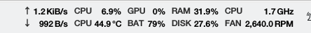
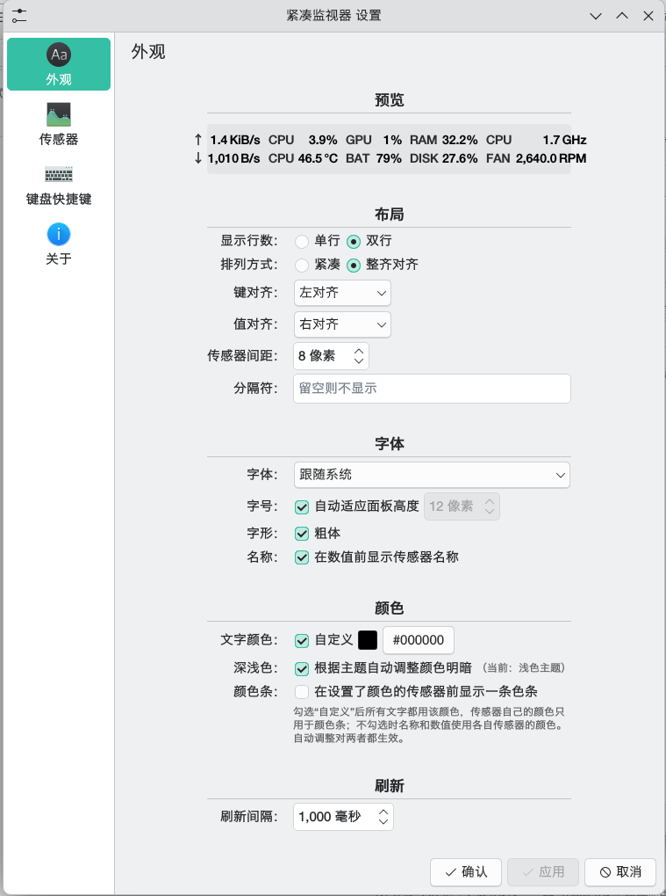
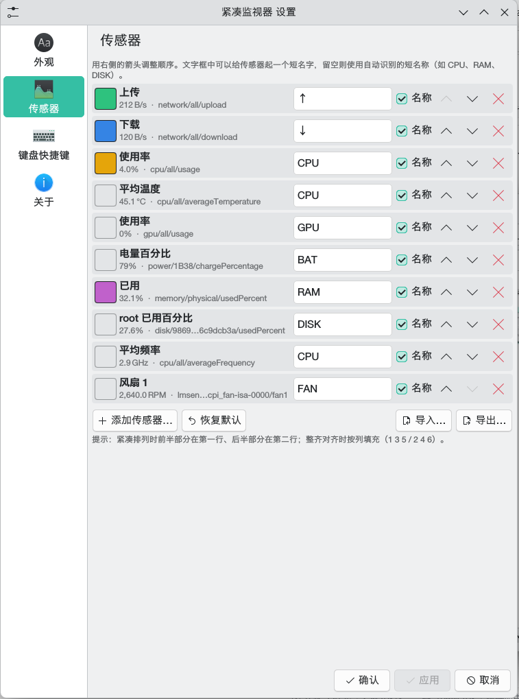
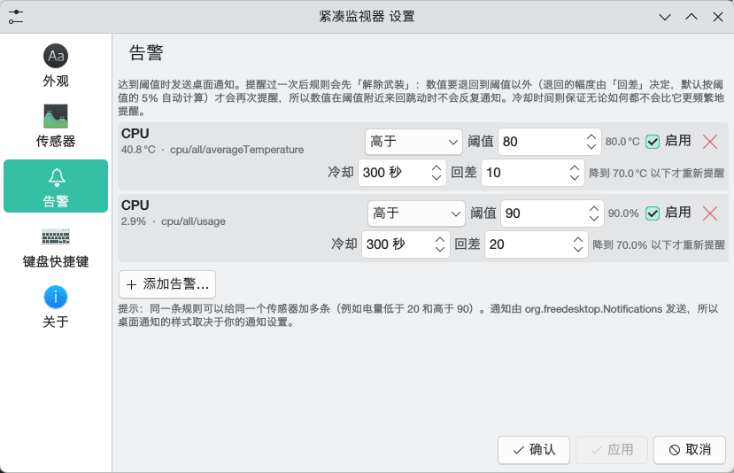
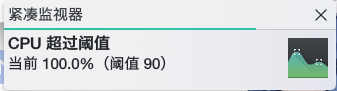

# Compact Monitor

**A tiny hardware monitor for the KDE Plasma 6 panel.**

[English](README.md) · [简体中文](README.zh_CN.md)

CPU, memory, GPU, disk, network, battery, fan… rendered as plain text, in the spirit of
[TrafficMonitor](https://github.com/zhongyang219/TrafficMonitor) on Windows.



> [!IMPORTANT]
> **This is an AI-generated project.**
> Almost all of the code and documentation in this repository was written by an AI coding
> assistant from a series of prompts and screenshots, then reviewed, run and
> tested on real hardware (Manjaro Linux, Plasma 6.7.4, Wayland). It is *not* the work of a
> seasoned QML developer, so expect rough edges. Issues and pull requests are very welcome —
> just keep in mind that the maintainer is reading AI-written code as well.

## Why another system monitor?

Plasma's own *System Monitor* widget can already show sensors as text
(`org.kde.ksysguard.textonly` face), but every sensor drags along a thick colored bar and a
lot of padding, so a handful of them fills half the panel. Compact Monitor draws nothing but
text and hugs its content: the screenshot above is ten sensors in two lines.

```
↑ 1.2 KiB/s   CPU 6.9%    GPU 0%    RAM 31.9%   CPU 1.7 GHz
↓ 992 B/s     CPU 44.9 °C BAT 79%   DISK 27.6%  FAN 2,640.0 RPM
```

## Features

* **Compact**: only text, the width follows the content, one or two lines
* **Two layouts**
  * *Packed* — each line is centered on its own, the most compact result
  * *Aligned* — a table: sensors fill columns (1 3 5 / 2 4 6, so related sensors such as
    upload/download or temperature/usage stack vertically)
* **Names and values can be aligned independently** (left / center / right) in the table layout
* **Automatic short names**: leave a sensor's label empty and it becomes `CPU`, `RAM`,
  `DISK`, `FAN`, `BAT`, `↓`, … (3–4 characters, derived from the sensor id)
* **Font control**: family, bold, and either an explicit pixel size (6–48) or a size that
  fits the panel height automatically
* **Per-sensor colors** plus an optional color bar, and an **automatic light/dark contrast
  adjustment** that keeps the colors readable on any theme
* **Sensor management**: add / remove / reorder with a searchable sensor picker, per sensor
  label and color
* **Threshold alerts**: get a desktop notification when a sensor goes above or below a value;
  a deadband (hysteresis) and a cooldown keep a value that wobbles around the threshold from
  notifying over and over
* **Import / export** sensors, appearance and alert rules as a JSON file; broken entries are
  skipped and reported instead of failing the whole import
* **Room for external content**: reserve one or more areas next to the sensors and let any program
  write into them — see [External content placeholder](#external-content-placeholder)
* **Languages**: Chinese and English ship with it, the language follows the system by default and
  can also be set per widget; adding a language is one small file, see [Translating](#translating)
* **Details**: hover tooltip listing every sensor (Plasma's own tooltip layout stops after eight
  lines, so the widget supplies its own), custom refresh interval (100 ms – 10 s),
  item spacing, an optional separator character, click for a larger popup view
* Right-click → *Configure Compact Monitor…* opens the standard Plasma configuration dialog
* UI strings are Chinese for now — an English translation is a welcome contribution

## Screenshots

| Panel                                        | Configuration → Appearance               |
| -------------------------------------------- | ----------------------------------------- |
|  |  |

| Configuration → Sensors               |
| -------------------------------------- |
|  |

| Configuration → Alerts |
| ---------------------- |
|  |

## Requirements

* KDE Plasma **6** — developed on 6.7.4 (Manjaro Linux, Wayland) and also tested on 6.3.6
  (Debian 13), which is the oldest version it has been run on
* `libksysguard` — provides the `org.kde.ksysguard.sensors` QML module the widget reads
* `ksystemstats` running (part of any normal Plasma session)
* `org.kde.plasma.plasma5support` — only used for import/export (ships with Plasma 6)

No compilation, no C++, no build system: it is a pure QML plasmoid.

## Installation

The easiest way is to download the package file — from
[store.kde.org](https://store.kde.org/p/2374718) or from a [release](https://github.com/MC-DALIU/KDE_Compact_sensor_monitor/releases) — and install
that:

```bash
kpackagetool6 --type Plasma/Applet --install compact-monitor-<version>.plasmoid
```

or right-click the panel → **Add Widgets…** → **Install Widget From Local File…** and pick the
`.plasmoid` file. `<version>` is whatever you downloaded: the version in the file name is only there
to tell releases apart, what identifies the package is its `.plasmoid` ending and its
`metadata.json` (`Id` and `Version`), so renaming the file does not change anything.

> [!NOTE]
> Plasma's *Add Widgets… → Get New Widgets…* does **not** list this widget (third-party Plasma 6
> entries are not offered there), so please download the file from the store page and install it
> manually as above.

To use the sources instead:

```bash
git clone https://github.com/MC-DALIU/KDE_Compact_sensor_monitor.git plasma-compact-monitor
cd plasma-compact-monitor
./install.sh
```

`install.sh` installs (or updates) the plasmoid and restarts `plasmashell`:

```bash
./install.sh               # install and restart plasmashell
./install.sh --no-restart  # install only
./install.sh --uninstall   # remove the widget
```

Or by hand:

```bash
kpackagetool6 --type Plasma/Applet --install org.mcdaliu.compactmonitor
# updating: use --upgrade, or --remove first
```

`./package.sh` builds that same archive from a checkout. The panel dialog and the store both need a
single archive with `metadata.json` at its root, so a freshly cloned repository cannot be installed
that way.

Then right-click the panel → **Add Widgets…** → search for *Compact Monitor*.

> [!WARNING]
> **Restart plasmashell after installing or updating.**
> plasmashell caches a widget's QML per plugin id, so simply removing and re-adding the
> widget does **not** pick up changed files:
>
> ```bash
> systemctl --user restart plasma-plasmashell
> ```
>
> or log out and back in.

## Configuration

Right-click the widget → *Configure Compact Monitor…*. There are two pages.

### Appearance

| Option                | Description                                                                           |
| --------------------- | ------------------------------------------------------------------------------------- |
| Lines                 | one or two text lines                                                                 |
| Layout                | *Packed*: each line centered on its own; *Aligned*: a table with lined-up columns |
| Key / value alignment | how names and values are aligned inside their column in the table layout              |
| Sensor spacing        | pixels between two sensors                                                            |
| Separator             | optional character drawn between sensors (never after the last column)                |
| Font / size / bold    | system font or any installed family; 6–48 px, or auto-fit to the panel               |
| Show names            | whether the name is drawn in front of the value                                       |
| Text color            | custom color for all text, otherwise every sensor uses its own color                  |
| Dark/light            | automatically darken colors on light themes and brighten them on dark ones            |
| Color bar             | draw a small colored bar in front of sensors that have a color                        |
| External content      | reserve one or more areas that show what other programs push in (added like sensors) |
| Interface file        | an area called `music` reads `<directory>/music.json`; the directory is configurable |
| Read interval         | how often those files are read — one process per interval, none while unused   |
| Content position      | each area picks a slot among the sensors, so the two can be interleaved        |
| Content font size     | a size of its own, or "follow" the widget's — handy for full-height areas      |
| Language              | *Follow the system* or any language that has a file (Chinese and English ship with it) |
| Refresh interval      | 100–10000 ms                                                                         |

The page starts with a live preview built from the *currently applied* sensor list, so
layout, font, alignment and color changes can be judged before pressing *Apply*.

### Sensors

Every row offers a color swatch, the sensor's own name, its live value and id, a label field
(the grey placeholder is the automatically recognized short name), a *Name* checkbox and
move up / move down / remove buttons. *Add sensor…* opens a searchable tree of everything
`ksystemstats` reports, *Restore defaults* brings back the shipped four, and
*Import…* / *Export…* read and write JSON files.

### Alerts

Each rule takes two lines: the sensor (with its live value and id), *above* / *below*, the
threshold, a cooldown in seconds and a deadband, an enable checkbox and a delete button. The grey
text next to the deadband says when the rule will arm again. *Add alert…* picks a sensor from
the searchable tree; the same sensor can have several rules (for example battery below 20 and
above 90). The grey text next to the threshold shows it converted with the sensor's unit, and
the live value in the row tells you what a sensible threshold is.

## Threshold alerts

A rule notifies you when its sensor crosses a threshold:

* **Condition** — *above* or *below*, compared against the sensor's raw value (the same number
  the widget displays, before any unit formatting; the converted value is shown next to the
  field so you can sanity check it)
* **Deadband** (hysteresis) — how far the value has to come back before the rule may fire
  again. It defaults to 5% of the threshold, so a "CPU temperature above 80" rule arms again only
  once the temperature drops to 76 or below: a value wobbling between 81 and 79 notifies once
  instead of on every crossing. `0` disables the deadband.
* **Cooldown** — a notification is never sent more often than this, whatever else happens
* **Enabled** — turn a rule off without deleting it

Firing works in two steps: the rule is *armed*, it fires when the value crosses the threshold,
and it then stays disarmed until the value has come back past the threshold by the deadband. The
cooldown is a second, independent limit on top of that, so nothing can ever notify more often
than once per cooldown.

Notifications are sent through the desktop notification service
(`org.freedesktop.Notifications`), so they look like any other Plasma notification and follow
your notification settings. A rule that fires looks like this:



Rules live in the widget configuration; since they are part of the exported JSON, they travel
with the rest of your setup.

## External content placeholder

The widget can reserve one or more areas for content that other programs push in: a music player's
current title, a script's output, a build status, anything. Each area has a name, and that name is
also the file it reads — so "give the music player an area called `music`" and it writes into
`~/.cache/compact-monitor/music.json`. No library, port or plugin is involved, so any language, or a
plain shell script, can do it.

Areas are configured on their own *External content* page in the widget's settings: a name, where it
sits among the sensors — in front of all of them, or right after any one of them, so areas and sensors
can be mixed freely — half or full height, a fixed / minimum / maximum width, a font size of its own
(or "follow" the widget), and whether the space stays reserved while there is nothing to show. An area
collapses when it is empty unless you ask it to keep its space.

Heights are measured against the sensors' own text, not against the panel, so a full-height area can
never make the widget taller than the panel. In the aligned layout a full-height area gets a column of
its own, with the sensors continuing on either side of it; in the packed layout it takes the height of
the sensors' text block. A full-height area usually looks better with a larger font size of its own.

### The protocol

Write what should be shown into the area's file — `~/.cache/compact-monitor/<name>.json`, or wherever
the *interface file directory* points:

* **plain text** — the whole file is shown, newlines break lines:

  ```bash
  echo "Now playing: Something" > ~/.cache/compact-monitor/music.json
  ```

* **a JSON object** — for a colour, an alignment and a longer tool tip:

  ```json
  { "text": "CPU 92 °C", "color": "#ff5555", "align": "center", "tooltip": "CPU is running hot" }
  ```

  | key | meaning |
  | --- | --- |
  | `text` | what the area shows; `\n` breaks lines |
  | `color` | optional text colour, `#rgb`, `#rrggbb` or `#aarrggbb` |
  | `align` | optional `left` (the default), `center` or `right` |
  | `tooltip` | optional text for the widget's tool tip |

An empty file means "nothing to show". Content is rendered as plain text, so nothing in it can be
taken for markup, and the files are only ever read — nothing is uploaded anywhere. A file caught
half-written is ignored until it parses again, so a writer does not have to be careful, although
writing through a temporary file and renaming it is still the safest way to publish.

The same thing from other languages — the widget does not care how you write it:

```python
# Python
import json, pathlib
pathlib.Path.home().joinpath(".cache/compact-monitor/music.json").write_text(
    json.dumps({"text": "Now playing: Something", "color": "#66ccff"}), encoding="utf-8")
```

```bash
# a small helper ships with the sources
tools/compact-monitor-push --id music "Now playing: Something"
tools/compact-monitor-push --id music --color '#66ccff' --align center "Something"
tools/compact-monitor-push --id music --clear
```

### What it costs

All files are read by **one** command per interval, and the reading itself uses the shell's own
builtin instead of a `cat` process per area, so the cost does not grow with the number of areas.
Measured on a laptop, five areas, one-second interval:

| | per poll | at 1 Hz |
| --- | --- | --- |
| one area | 1.7 ms | ≈ 0.17 % of one core |
| five areas | 1.7 ms | ≈ 0.17 % of one core |
| an empty shell, for comparison | 1.4 ms | ≈ 0.14 % of one core |

**The widget never writes anything.** It only reads the files, and because it reads them every second
the kernel keeps them in the page cache, so the polling costs no disk I/O at all. The writing is done by
the program that pushes, and it rewrites one file rather than creating new ones. Even at one update per
second the file system's minimum write unit (usually 4 KB) dominates the payload: roughly 350 MB a day,
which is nothing against an SSD's endurance — but if you want it to be exactly zero, set the *interface
file directory* to a memory file system such as `/dev/shm/compact-monitor`. The content then disappears
on reboot, which for a "now playing" line is usually fine. (This also avoids the extra write
amplification of copy-on-write file systems like btrfs or ZFS.)

Nothing runs at all while no area is configured, and the *read interval* on the *External content* page
can be raised (2 s, 5 s, …) to lower it further. For scale: the sensors this widget shows are updated by
`ksystemstats` once per second, which costs considerably more than that.

## Sensor IDs

The sensor list comes from `ksystemstats`. To list every id available on your machine:

```bash
qdbus6 --literal org.kde.ksystemstats1 /org/kde/ksystemstats1 \
    org.kde.ksystemstats1.allSensors | grep -o '"[a-z0-9/_-]*"'
```

Some useful ones:

| Sensor                              | ID                                                                              |
| ----------------------------------- | ------------------------------------------------------------------------------- |
| CPU usage / temperature / frequency | `cpu/all/usage`, `cpu/all/averageTemperature`, `cpu/all/averageFrequency` |
| Physical memory, swap               | `memory/physical/usedPercent`, `memory/swap/usedPercent`                    |
| Network up / down                   | `network/all/upload`, `network/all/download`                                |
| Disk read / write                   | `disk/all/read`, `disk/all/write`                                           |
| GPU                                 | `gpu/gpu0/usage`, `gpu/gpu0/temperature`, `gpu/gpu0/power`                |
| Fans and temperatures               | `lmsensors/<chip>/fan1`, `lmsensors/<chip>/temp1`                           |
| Battery                             | `power/<battery>/chargePercentage`, `power/<battery>/chargeRate`            |

The shipped default is `network/all/upload` (↑), `network/all/download` (↓),
`cpu/all/usage` (CPU) and `memory/physical/usedPercent` (RAM), on two lines.

## Automatic short names

When a sensor has no label of its own, its name is derived from the sensor id
(`contents/ui/SensorNames.js`) — first the first path component, then a few
metric-specific refinements:

| Sensor ID                                         | Name    |  | Sensor ID                     | Name |
| ------------------------------------------------- | ------- | - | ----------------------------- | ---- |
| `cpu/all/usage`, `cpu/all/averageTemperature` | CPU     |  | `power/…/chargePercentage` | BAT  |
| `gpu/gpu0/usage`                                | GPU     |  | `power/…/chargeRate`       | PWR  |
| `memory/physical/usedPercent`                   | RAM     |  | `lmsensors/…/fan1`         | FAN  |
| `memory/swap/usedPercent`                       | SWAP    |  | `lmsensors/…/temp1`        | TEMP |
| `disk/nvme0n1/read`                             | DISK    |  | `lmsensors/…/in0`          | VOLT |
| `network/all/download` / `upload`             | ↓ / ↑ |  | `network/wlp1s0/signal`     | WIFI |

Anything else is abbreviated to the first four upper-case characters
(`wifi/foo/bar` → `WIFI`). The three tables `GROUPS`, `METRICS` and `HARDWARE_PREFIXES` in
`SensorNames.js` are easy to extend.

## Import / export

*Export…* on the sensors page writes a file like this:

```json
{
  "applet": "org.mcdaliu.compactmonitor",
  "version": 2,
  "exportedAt": "2026-09-25T13:44:10.398Z",
  "appearance": {
    "lineCount": 2, "tableLayout": true, "labelAlignment": 0, "valueAlignment": 2,
    "autoFontSize": true, "fontSize": 12, "fontFamily": "", "bold": true,
    "showNames": true, "itemSpacing": 8, "separator": "", "showColorBar": false,
    "customTextColor": false, "textColor": "#ffffff", "autoAdaptColors": true,
    "updateInterval": 1000
  },
  "sensors": [
    { "sensorId": "network/all/upload", "label": "↑", "color": "#2ec27e", "showLabel": true },
    { "sensorId": "cpu/all/usage", "label": "CPU", "color": "#e5a50a", "showLabel": true }
  ],
  "alerts": [
    { "sensorId": "cpu/all/usage", "condition": "above", "threshold": 90, "cooldown": 300,
      "enabled": true, "hysteresis": -1 }
  ]
}
```

In an alert rule `hysteresis` is the deadband: a number, `0` to disable it, or `-1` (or nothing
at all) to derive it from the threshold.

*Import…* accepts that object or a plain array of entries. Only `sensorId` is required —
`label`, `color` and `showLabel` may be omitted. `color` accepts `#rrggbb` as well as KDE's
`r,g,b` form, `showLabel` accepts `true/false/1/0`. The `appearance` and `alerts` sections are
optional, so files written before they existed still import fine. Everything is validated piece
by piece and bad parts are **skipped and reported** in a message bar at the top of the page (up
to eight details; everything also goes to the plasmashell log):

| Problem                           | Behaviour                              |
| --------------------------------- | -------------------------------------- |
| not an object, or no `sensorId`  | skipped                                |
| sensor id unknown on this machine | skipped                                |
| the same id twice                 | the later one is skipped               |
| unparsable `color`               | entry kept, color ignored (reported)   |
| appearance value out of range     | clamped to the allowed range, and reported             |
| appearance value of the wrong type | kept as it was, and reported                          |
| alert rule without `sensorId`, unknown sensor, non-numeric threshold | skipped        |
| alert rule with a negative or non-numeric deadband | treated as automatic, and reported |
| broken JSON / unreadable file     | red error message, nothing is imported |

Importing **replaces** the current sensor list, writes the appearance settings and replaces the
alert rules. Appearance changes land in the widget configuration immediately, so the
*Appearance* page shows them the next time you open it.

## How it works

A few notes for anyone who wants to hack on it (or write a similar widget):

* Sensor data comes from libksysguard's QML modules (`org.kde.ksysguard.sensors`: `Sensor`,
  `SensorTreeModel`), which talk to `ksystemstats` — the same data the System Monitor uses,
  no C++ required.
* **Panel width**: the panel layout only reads `Layout.preferredWidth` / `implicitWidth` of
  the *applet item itself* (see plasma-desktop `containments/panel/contents/ui/main.qml`), so
  `main.qml` mirrors the compact representation's width onto the root object. Sizing only the
  compact representation makes the applet fall back to a minimum width (28 px).
* **Automatic font size** is derived from the height the panel gives us:
  `min(height / lines × 0.78, gridUnit × 0.8)`, clamped to 7–28 px.
* **Dark/light adaptation** (`contents/ui/ColorUtils.js`) uses WCAG relative luminance and
  contrast: hue and saturation are kept and the brightness is binary-searched until it just
  reaches a 4.0:1 contrast ratio against the background. A green therefore stays green,
  instead of turning magenta as a plain RGB invert would. The background is
  `Kirigami.Theme.backgroundColor`, which Plasma fills in from the real panel background (so
  a dark panel on a light theme also works).
* **Files** (`export` / `import`) go through `org.kde.plasma.plasma5support`'s `executable`
  data source, because QML has no file API. Commands run through a shell, so
  `printf %s … > file` works; completion is signalled by an `"exit code"` key (with a space)
  and output may arrive in several chunks.
* **Config pages** receive `cfg_<key>` initial properties which are read back when saving, so
  every editable value is named `cfg_*`.
* Alert state is keyed by the rule's own content, not by its position: reading
  `Plasmoid.configuration` re-evaluates the binding that builds the rule list even when the rules
  did not change (a config map is not an ordinary property), and a per-index state reset there let
  a second notification slip through a one-hour cooldown.
* Writing a **one-element `StringList` through the scripting interface corrupts it**:
  `writeConfig("placeholders", ["a|b|c"])` stores the value character by character, comma separated,
  and every read/write round trip adds another layer of escaping - reading it back even gives a string
  rather than a list. Change such settings in the configuration dialog (the normal path), or stop
  Plasma and edit `plasma-org.kde.plasma.desktop-appletsrc` by hand.
* **Desktop notifications** also use the `executable` data source: a `gdbus call` to
  `org.freedesktop.Notifications.Notify`, with every argument passed through `ShellUtils.quote()`
  (the panel-spacer widget does the same). Alert rules are stored as one
  `sensorId|condition|threshold|cooldown|enabled` string per rule and decoded by
  `contents/ui/AlertRules.js`.
* Do not reach for a `const`/`let` before its declaration in QML JavaScript: it is a temporal
  dead zone error, and because it happens inside a signal handler the rest of that function is
  silently skipped (it cost an evening while debugging the alerts).
* **The preview** on the *Appearance* page is not scaled with a transform: shrinking an item that
  way re-rasterizes the glyphs, which makes the strokes look uneven. It reduces the font size until
  the content fits instead, measuring the natural width on a hidden copy of the view (measuring the
  visible one would feed back into itself and oscillate). The preview also lives outside the
  `Kirigami.FormLayout`, because a section item there does not stretch to the page width.
* Configuration pages have **no `Plasmoid` object**: the dialog runs them in its own context, so
  reading `Plasmoid.configuration` throws "ReferenceError: Plasmoid is not defined" and silently
  kills the rest of that function (it broke export/import here until
  `journalctl --user -u plasma-plasmashell` showed it - the offscreen test had stubbed `Plasmoid`,
  which masked exactly the thing under test). A page declares the values it needs as `cfg_*`
  properties instead: the dialog hands *every* config key to the page it shows
  (`props["cfg_" + key] = config[key]`) and saves back the ones the page declares. That is why the
  sensors page also declares the appearance keys and the alert rules - they are part of its JSON
  file. Plasma additionally offers each key as `cfg_<key>Default`, which is why the log mentions
  unknown `cfg_lineCountDefault`-style properties; that part is harmless.
* The external content is *polled* rather than streamed: QML has no file API, and the executable
  data engine only returns a command's output once the command has finished - a long-running
  `tail -F` never delivered a single line in testing, so a `cat` per refresh interval it is.
* Do not use QML type keywords as JavaScript identifiers: older QML engines (Qt 6.8, as shipped by
  Debian 13) reject `short`, `color`, `list`, `url`, `action`, `real`, `int` and friends with
  "Expected token `identifier`", while Qt 6.9 accepts them. That is why the colour dialog's property
  is `selectedColor` rather than `color`, the locale helper uses `shortCode`, and so on - and why
  renaming one of them means grepping for its old name everywhere, not just where it is declared.
* Translations are one QML file per language in `contents/i18n/`, looked up by a singleton
  (`contents/ui/i18n/I18n.qml`) whose `strings` property the user interface reads in its bindings, so
  a language change re-evaluates the whole interface without restarting anything. See
  [Translating](#translating) for why it is not `i18n()`/`.po` files.
* Plasma's default tool tip layout caps `subText` at eight lines
  (`org.kde.plasma.core/DefaultToolTip.qml`, `maximumLineCount: 8`), which silently drops the rest
  of a long sensor list. `contents/ui/ToolTipContent.qml` is handed to the applet as `toolTipItem`
  instead, wrapped in an invisible host so it cannot paint over the widget before the tool tip
  adopts it. Careful: `toolTipItem` is a property of `PlasmoidItem` itself, *not* of the `Plasmoid`
  context object - `Plasmoid.toolTipItem: ...` makes the whole applet fail to load with "Cannot
  assign to non-existent property", which is what `journalctl --user -u plasma-plasmashell` shows.
  `toolTipTextFormat` is the same trap - it belongs to `PlasmoidItem` as well.
* `Kirigami.FormLayout` sizes its rows by the children's `implicitHeight`, and a `QQC2.Label`
  with `wrapMode` still reports its full unwrapped width as `implicitWidth`. Both behaviours
  bit the configuration pages — see the comments in `HintLabel.qml` and
  `ConfigAppearance.qml`.

## Troubleshooting

| Symptom                                                       | Cause / fix                                                                                     |
| ------------------------------------------------------------- | ----------------------------------------------------------------------------------------------- |
| After an update the widget shows nothing, or is a tiny square | either plasmashell's QML cache (restart plasmashell) or a QML error: `journalctl --user -u plasma-plasmashell` prints the file and line |
| A sensor always shows`--`                                   | that sensor id does not exist on this machine; check the picker                                 |
| Colors look washed out                                        | that is the automatic contrast adjustment; turn *Dark/light* off to keep your colors untouched |
| The widget is too wide                                        | fewer sensors, hide the names, smaller font, or the *Packed* layout                            |
| The placeholder area stays empty | check that it is enabled, that the *content file* is the file you write to, and that the file is not empty; it is read once per refresh interval |
| Want to get rid of it                                         | `./install.sh --uninstall`, then remove the leftover icon from the panel                      |
| Alerts never fire                                             | check that the rule is enabled and that its sensor really crosses the threshold; after a notification the rule stays quiet for its cooldown |
| Notification does not appear                                  | they are ordinary desktop notifications: check *System Settings → Notifications* and do-not-disturb |

## Known limitations / roadmap

* Values are not padded to a fixed width, so their length can change as the numbers grow (the
  *aligned* layout at least keeps the columns themselves stable)
* No graphs or history yet
* Only Chinese and English are translated so far — see [Translating](#translating), it is one file
  per language

## Translating

Translations live in `org.mcdaliu.compactmonitor/contents/i18n/`, one file per language — `en.qml`
for English:

```qml
import QtQuick

QtObject {
    readonly property var strings: ({
        "外观": "Appearance",
        "%1 秒": "%1 seconds"
    })
}
```

The keys are the Chinese source strings of the user interface and have to stay as they are; `%1`,
`%2`, … are replaced by the arguments of the call, so a translation may put them in any order. A key
that is missing from the file falls back to the Chinese source string, which means a half-finished
translation is perfectly usable.

To add a language:

1. copy `contents/i18n/en.qml` to `<code>.qml`, using the code Qt knows (`de`, `fr`, `pt_BR`, …)
2. translate the values, leaving the keys alone
3. add the language to `supportedLanguages` in `contents/ui/i18n/I18n.qml`
4. test it: the widget follows the system language, and the *Appearance* page has a language selector

Chinese needs no file at all — the source strings *are* the Chinese text. For context: translations
are looked up by this mapping rather than through `i18n()`, because a plasmoid cannot change the
language of `i18n()` at runtime from QML, and the JSON files one might expect cannot be read either
(Qt refuses `file://` XHR without `QML_XHR_ALLOW_FILE_READ=1`).

## Contributing

Issues, screenshots of your own panel setup and pull requests are welcome. User-visible changes
belong in [CHANGELOG.md](CHANGELOG.md) under *Unreleased* (and in
[CHANGELOG.zh_CN.md](CHANGELOG.zh_CN.md), which is its Chinese translation — please keep the two in
step). To release: move them into a new version
section, bump `KPlugin.Version` in
[`metadata.json`](org.mcdaliu.compactmonitor/metadata.json) to match, run `./package.sh`, then tag
`v<version>` and attach the `.plasmoid` to the GitHub release (and upload it to store.kde.org). If you touch QML files, please run at least

```bash
qmllint org.mcdaliu.compactmonitor/contents/ui/*.qml
```

and restart plasmashell while testing. Keep in mind that the project is AI-generated: expect
inconsistencies, and feel free to point them out.

## Credits

* [KDE](https://kde.org) Plasma, [libksysguard](https://invent.kde.org/plasma/libksysguard)
  and `ksystemstats` for the sensor infrastructure this widget is built on
* [TrafficMonitor](https://github.com/zhongyang219/TrafficMonitor) for the original idea and
  the look this widget tries to match
* The screenshots use the Breeze Plasma theme

## License

GPL-2.0-or-later — see [LICENSE](LICENSE). Every source file carries an SPDX header; the
`LICENSE` file contains the GPL-2.0 text and the "or later" option is expressed in those
headers.
